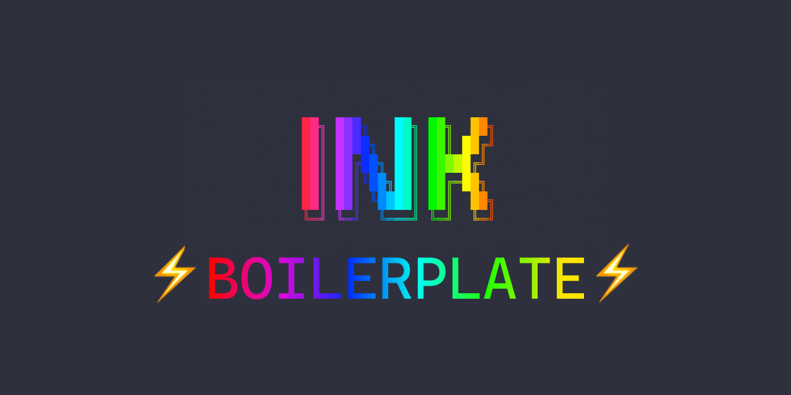

<h1 align="center">
  
</h1>

# Ink Boilerplate

> Ink CLI Project Starter Kit

## Usefull Package Included

- [Typescript](http://www.typescriptlang.org/)
- [Prettier](https://prettier.io/)
- [PNPM](https://pnpm.js.org/)
- [Jest](https://jestjs.io/)
- [Husky](https://github.com/typicode/husky)

You can read [ink documentation here](https://github.com/vadimdemedes/ink) and use these [component to make your CLI cool, cooler, coolest](https://github.com/vadimdemedes/ink#useful-components)

This project inspired by [Emma-cli](https://github.com/maticzav/emma-cli/) project structures.

## License

MIT © [Muhammad Rivki](https://github.com/mikqi/)
