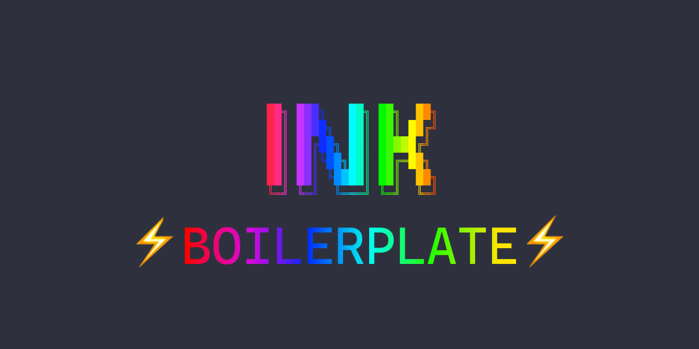

<h1 align="center">
  
</h1>

# Ink Boilerplate

> Ink CLI Project Starter Kit

## Useful Package Included

- [Typescript](http://www.typescriptlang.org/)
- [Biome](https://biomejs.dev/)
- [PNPM](https://pnpm.js.org/)
- [tsup](https://tsup.egoist.dev/)
- [Vitest](https://vitest.dev/)
- [simple-git-hooks](https://github.com/toplenboren/simple-git-hooks)

You can read [ink documentation here](https://github.com/vadimdemedes/ink) and use these [component to make your CLI cool, cooler, coolest](https://github.com/vadimdemedes/ink#useful-components)

This project inspired by [Emma-cli](https://github.com/maticzav/emma-cli/) project structures.

## Development

During the `prepare` lifecycle (including `pnpm install`), the repository configures Git hooks with `simple-git-hooks`.
The included `pre-commit` hook runs `pnpm run check`.
If the hook rewrites files, review and re-stage those changes before re-running the commit.
If you are migrating from an older local checkout that used a custom hooks path, reset it with `git config core.hooksPath .git/hooks`.

## License

MIT © [Muhammad Rivki](https://github.com/mikqi/)
